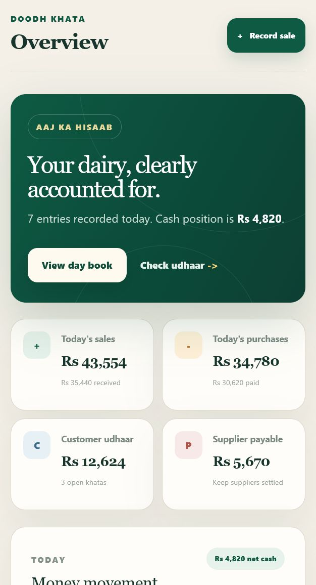
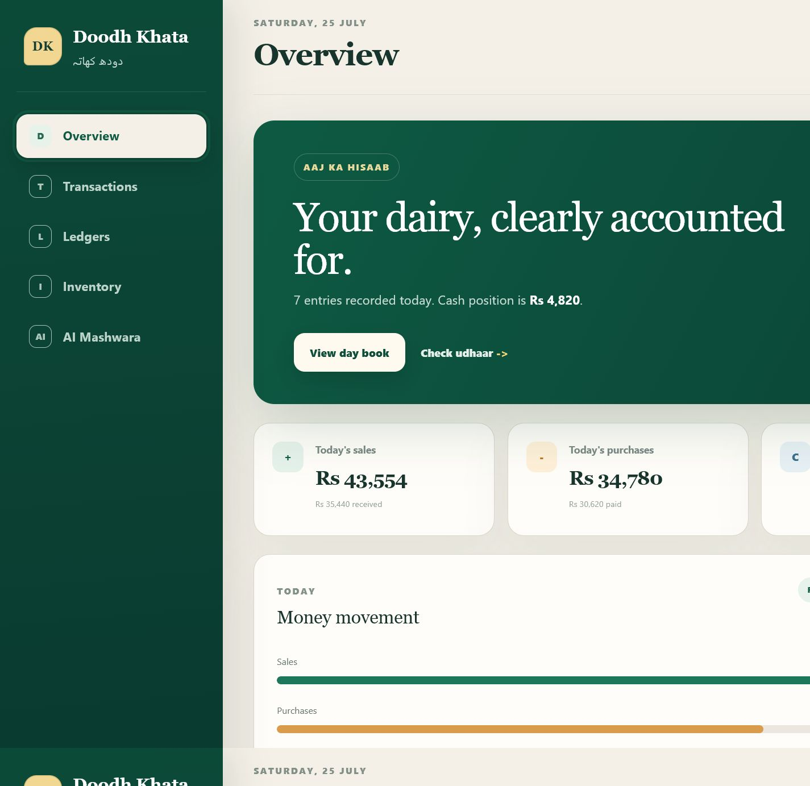
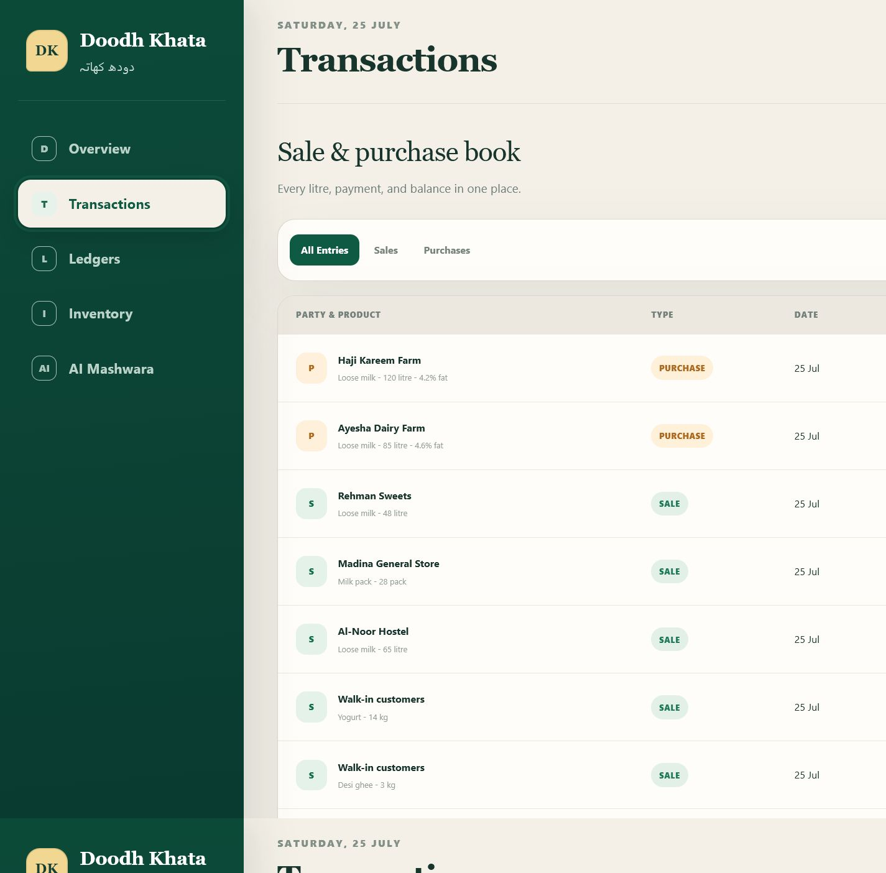
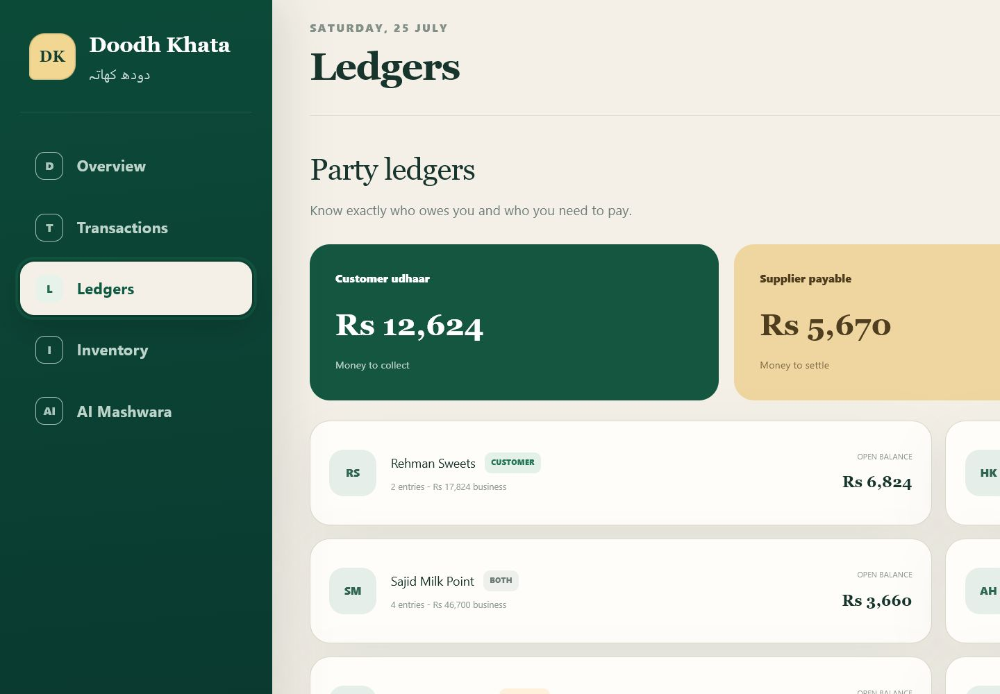

# Doodh Khata (Dairy Business Book)

> **Har litre ka hisaab.**

Doodh Khata is a mobile-first, installable dairy sales and purchasing app for farmers, milk collectors, and dairy shop owners in Pakistan. It replaces scattered paper registers, mental calculations, and easily forgotten credit with one clear daily business book.

| Project detail | Information |
| --- | --- |
| Project owner and developer | **Fazeel Ellahi** |
| Institution | **University of Veterinary and Animal Sciences (UVAS)** |
| Live application | [**doodh-khata-sigma.vercel.app**](https://doodh-khata-sigma.vercel.app) |
| GitHub owner | [**FazeelE**](https://github.com/FazeelE) |
| Public repository | [github.com/FazeelE/doodh-khata](https://github.com/FazeelE/doodh-khata) |
| App format | Installable mobile-first Progressive Web App |
| Project status | Complete, tested, Firebase-ready, and deployed live |


## Project report contents

- [The real problem](#the-real-problem)
- [Who it is for](#who-it-is-for)
- [Features](#features)
- [AI feature: Rozana Mashwara](#ai-feature-rozana-mashwara)
- [Screenshots](#screenshots)
- [Technology and services](#technology-and-services)
- [Live deployment](#live-deployment)
- [Firebase setup](#firebase-setup)
- [How to run the project](#run-locally)
- [Firestore structure](#firestore-structure)
- [Design decisions](#design-decisions)
- [Privacy and security](#privacy-and-security)
- [Future improvements](#future-improvements)

## The real problem

Small dairy businesses often operate through handwritten khatas and WhatsApp messages. One person may buy loose milk from several farmers, sell it to shops and households, carry customer credit, owe suppliers, and manage products measured in litres, kilograms, and packs—all on the same day. This creates three practical problems:

1. Stock is difficult to know without manually reconciling purchases and sales.
2. Customer udhaar and supplier payables are easy to mix up.
3. Raw figures do not tell an owner what deserves attention today.

Doodh Khata turns each sale or purchase into updated inventory, cash movement, and party-ledger information. Its AI advisor then converts those numbers into a short daily briefing.

## Who it is for

- Dairy farmers recording direct sales and payments
- Milk collectors buying from farms and supplying businesses
- Dairy shop owners selling loose milk and packaged dairy products
- Small teams that need a simple phone-first tool instead of accounting software

## Features

### Daily business overview

- Today's sales, purchases, cash received, and cash paid
- Customer receivables and supplier payables
- Recent transactions and live stock at a glance
- Clear low-stock and open-balance indicators

### Sale and purchase book

- Record sales or purchases in a touch-friendly mobile form
- Track customer or supplier, product, date, quantity, unit, and rate
- Record partial payments and calculate the remaining balance automatically
- Capture milk fat percentage and optional quality/delivery notes
- Search and filter all entries
- Delete incorrect entries with confirmation

### Party ledgers

- Automatic customer, supplier, or dual-role classification
- Complete business value, payment total, open balance, and entry count per party
- Separate customer udhaar and supplier-payable summaries

### Inventory

- Supports loose milk, yogurt, desi ghee, butter, cream, paneer, and milk packs
- Handles litre, kilogram, and pack units
- Calculates stock from purchases minus sales—no duplicate stock entry
- Flags low or unrecorded stock immediately

### Mobile app experience

- Installable Progressive Web App (PWA)
- Standalone home-screen mode with branded app icons
- Phone-first bottom navigation and touch targets
- Responsive desktop layout for graders and office use
- Offline app-shell fallback through a service worker

### Firebase data layer

- Cloud Firestore as the production database
- Anonymous Firebase Authentication gives each installation a private user path
- User records live under `/users/{uid}/transactions/{transactionId}`
- Firestore Security Rules prevent one user from reading another user's records
- Demo mode works before Firebase is connected, making the interface easy to review

## AI feature: Rozana Mashwara

Rozana Mashwara reviews the user's recent sales, purchases, payments, stock movement, and open credit. It produces a short daily briefing covering cash, stock, and the most useful next action.

The production AI flow uses **Firebase AI Logic** with the **Gemini 3.5 Flash** model. The client sends a compact transaction summary—not arbitrary private notes—and the model is constrained by a system instruction written specifically for Pakistani dairy businesses.

### System instruction

```text
You are Rozana Mashwara, a careful business coach for small dairy farmers, milk collectors, and dairy shop owners in Pakistan. Analyze only the transaction summary supplied by the app. Use simple, respectful English with occasional familiar Urdu business words such as hisaab, udhaar, and mashwara. Start with one clear headline. Then give exactly three short bullet points: Cash, Stock, and Next step. Mention rupee amounts when useful. Never invent transactions, market prices, or guarantees. If data is limited, say so. Keep the full response under 130 words.
```

Additional safeguards:

- Temperature is kept low for consistent, practical output.
- The prompt forbids invented transactions, prices, and guarantees.
- Advice is limited to the data the app supplies.
- When Firebase AI is unavailable, the app clearly labels its deterministic example as a demo preview rather than pretending it is live AI.
- Firebase App Check with reCAPTCHA Enterprise is supported for production abuse protection.

## Screenshots

### Mobile-first overview



### Responsive business dashboard



### Sale and purchase book



### Customer and supplier ledgers



### AI daily briefing


## Technology and services

| Area | Tool or service |
| --- | --- |
| Application | React 19, TypeScript, Next.js App Router |
| Build and hosting | Next.js on Vercel; Vinext/Sites compatibility retained |
| Styling | Custom responsive CSS and accessible semantic HTML |
| Database | Firebase Cloud Firestore |
| Identity | Firebase Anonymous Authentication |
| AI | Firebase AI Logic, Gemini 3.5 Flash |
| AI protection | Firebase App Check, reCAPTCHA Enterprise |
| Offline/installability | Web App Manifest and service worker |
| Source control | Git and GitHub |
| Development workflow | OpenAI Codex, npm, ESLint, TypeScript, and Node.js tests |

## Live deployment

The production app is deployed on Vercel at
[doodh-khata-sigma.vercel.app](https://doodh-khata-sigma.vercel.app).
The deployment uses the **Next.js** preset, the repository root (`./`), and
`npx next build` as its production build command. The live desktop and mobile
layouts were verified after deployment, including the dashboard, transaction
actions, ledgers, inventory, AI Mashwara page, and mobile navigation.

The public demonstration works without private credentials. Add the Firebase
environment variables listed below in Vercel when live cloud persistence and
model-generated advice are required.
## Firebase setup

The app is fully implemented for Firebase, but every developer must connect their own Firebase project. Firebase's web configuration identifies the project; database privacy is enforced by Authentication, Security Rules, and App Check.

1. Open the [Firebase Console](https://console.firebase.google.com/) and create a project named `doodh-khata`.
2. Add a **Web app** from Project Overview. Copy the configuration values into a new `.env.local` based on `.env.example`.
3. Open **Build > Authentication > Sign-in method** and enable **Anonymous** authentication.
4. Open **Build > Firestore Database**, create the database, and choose the closest practical region.
5. Publish the included `firestore.rules` file using the Firebase CLI or paste it into the Firestore Rules editor.
6. Open **AI Services > AI Logic**, click **Get started**, and choose the Gemini Developer API.
7. Register the web app with **App Check** using reCAPTCHA Enterprise, then add its site key to `.env.local`.
8. Add the same environment values to the live hosting project, rebuild, and deploy.

Required variables:

```env
NEXT_PUBLIC_FIREBASE_API_KEY=
NEXT_PUBLIC_FIREBASE_AUTH_DOMAIN=
NEXT_PUBLIC_FIREBASE_PROJECT_ID=
NEXT_PUBLIC_FIREBASE_STORAGE_BUCKET=
NEXT_PUBLIC_FIREBASE_MESSAGING_SENDER_ID=
NEXT_PUBLIC_FIREBASE_APP_ID=
NEXT_PUBLIC_FIREBASE_AI_MODEL=gemini-3.5-flash
NEXT_PUBLIC_RECAPTCHA_ENTERPRISE_SITE_KEY=
```

> Firebase web configuration values are client identifiers, not server secrets. Still, environment files are ignored so different deployments can use different projects. Never commit private service-account credentials.

## Run locally

### Prerequisites

- Node.js 22.13 or newer
- npm
- A Firebase project for live database and AI features (optional—the app runs immediately in labelled demo mode)

### Installation

```bash
git clone https://github.com/FazeelE/doodh-khata.git
cd doodh-khata
npm install
```

Copy the environment template:

```bash
cp .env.example .env.local
```

On Windows PowerShell, use:

```powershell
Copy-Item .env.example .env.local
```

Fill in the Firebase values, then start the app:

```bash
npm run dev
```

Open the local URL printed by the development server. To verify the production build:

```bash
npm run build
```

Run the automated project checks:

```bash
npm test
npm run lint
```

If Firebase values are omitted, the complete interface and accounting workflow remain available with clearly labelled demonstration data. Adding the environment values activates private Firestore synchronization and live Gemini advice without changing the interface.

## Firestore structure

```text
users
  {anonymous-user-uid}
    transactions
      {transaction-id}
        kind: sale | purchase
        party: string
        product: string
        quantity: number
        unit: litre | kg | pack
        rate: number
        paid: number
        fat: number (optional)
        date: YYYY-MM-DD
        notes: string (optional)
        createdAt: number
```

## Design decisions

- **Urdu-inspired identity:** “Doodh Khata” uses familiar dairy and ledger language without making the app difficult for English-speaking graders.
- **One-entry accounting:** recording a transaction updates stock, cash, and party balances automatically.
- **Mobile before desktop:** dairy work happens at collection points, counters, and delivery locations, so the primary interaction model is a phone.
- **Explainable AI:** Rozana Mashwara sees a bounded summary and returns a fixed cash/stock/action structure.
- **No fake backend:** demo mode is visibly labeled; production persistence is implemented with Firestore and per-user security rules.

## Privacy and security

- API keys, service-account files, and local environment files are excluded from Git.
- Firestore access is restricted to the authenticated user's UID.
- Anonymous authentication avoids collecting names, emails, or passwords for this version.
- AI requests contain only the transaction fields required for the briefing.
- Firebase App Check can reject requests from unauthorized copies of the web client.

## Future improvements

The submitted version deliberately focuses on a complete core workflow. Future releases could add Urdu localization, printable monthly statements, Bluetooth receipt printing, staff roles, and optional phone-number account recovery.

## Submission checklist

- [x] Original app idea addressing a real dairy-business problem
- [x] Complete mobile sale, purchase, inventory, ledger, and dashboard workflows
- [x] AI feature with a documented custom system instruction
- [ ] Publicly accessible Fazeel-owned live application - check after deployment
- [x] Public GitHub repository
- [x] Five screenshots showing the app in action
- [x] Firebase database integration and security rules
- [x] Installation, configuration, testing, and run instructions
- [x] No private API keys or service-account credentials committed

---

Designed and developed by **Fazeel Ellahi**, University of Veterinary and Animal Sciences (UVAS), as an original final project for a real operational problem in Pakistan's dairy community.
